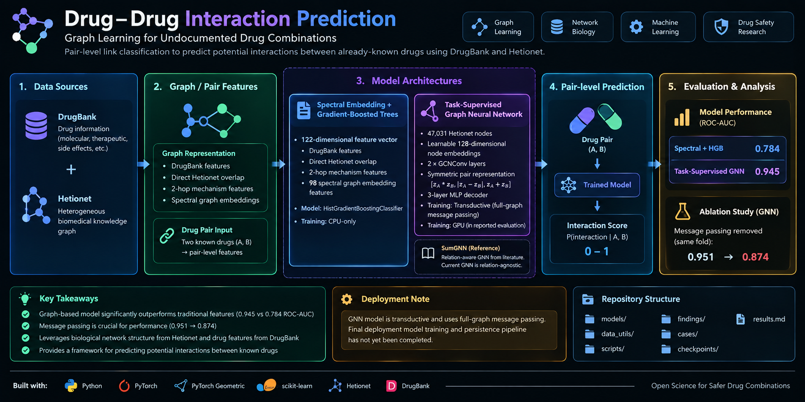

# 🧬 Cross-Model Drug–Drug Interaction Prediction

> **Graph learning and structured machine learning for predicting previously undocumented drug interactions.**

[](https://www.python.org/)
[](https://pytorch.org/)
[](https://www.dgl.ai/)
[](#data)
[](#research-focus)

This project investigates machine-learning approaches for predicting drug–drug interactions from biomedical graph structure and drug-level information.

The current repository has evolved beyond the earlier SumGNN benchmark and now contains both graph-neural and feature-engineered link-prediction experiments.

## Research question

Given two drugs with known biomedical context, can graph structure and learned representations identify interactions that are not explicitly documented?

## 🏗️ Current architecture



> Mermaid source: [`architecture.mmd`](architecture.mmd)

## Current model tracks

### Model 1 — Spectral Embedding + Gradient-Boosted Trees

A 122-feature pair representation combines:

- DrugBank-derived drug features
- direct Hetionet overlap features
- 2-hop mechanism features
- 96-dimensional spectral graph embeddings

The feature vector is classified with `HistGradientBoostingClassifier`.

**Reported ROC-AUC: 0.784**

### Model 2 — Task-Supervised Graph Neural Network

The current GNN pipeline uses:

- learnable 128-dimensional node embeddings
- two `GCNConv` layers
- a symmetric pair representation
- a 3-layer MLP decoder
- end-to-end binary cross-entropy training

**Reported ROC-AUC: 0.945**

An ablation reported a drop from **0.951 → 0.874** when graph message passing was removed for the same fold, supporting the contribution of graph structure in that experiment.

## Evaluation

The project focuses on avoiding misleading leakage and on measuring behaviour beyond a single random split.

Evaluation includes:

- known-drug / new-combination prediction
- leak-free evaluation
- ROC-AUC comparison
- graph-message-passing ablation
- cold-start analysis for unseen drugs
- model/scalability trade-offs

## Tech stack

| Area | Technologies |
|---|---|
| Language | Python |
| Deep learning | PyTorch |
| Graph learning | PyTorch Geometric / DGL components in project history |
| ML baselines | scikit-learn |
| Graph data | Hetionet |
| Interaction data | DrugBank |
| Data processing | Pandas / NumPy |
| Models explored | GNNs, MLP, gradient-boosted trees, SumGNN, KGNN, Decagon |

## 📁 Repository structure

```text
capstone/
├── data_utils/        # data preparation utilities
├── models/            # model implementations
├── scripts/           # training / evaluation scripts
├── cases/             # experiment cases
├── findings/          # experiment findings
├── checkpoints/       # model checkpoints
├── archive/           # archived experiments
├── results.md         # focused model comparison
└── requirements*.txt
```

## Why the comparison matters

The two current approaches make different engineering trade-offs:

| Property | Spectral + HGB | Task-supervised GNN |
|---|---|---|
| ROC-AUC | 0.784 | 0.945 |
| GPU for inference | No | Not inherently required |
| Training | Lightweight | GPU preferred |
| Representation | Fixed / unsupervised graph embedding + engineered features | Learned end-to-end |
| Graph updates | More flexible | Transductive; retraining implications |
| Explainability | Feature importances available | Learned representation is less direct |

The project therefore treats performance, leakage, compute cost and update behaviour as part of the research question—not just the headline score.

## Research status

This is an ongoing capstone/research project. The repository contains multiple experimental generations, so the README deliberately distinguishes the current model-comparison results from earlier benchmark work.

---

**Repository:** https://github.com/Vihas111/capstone
